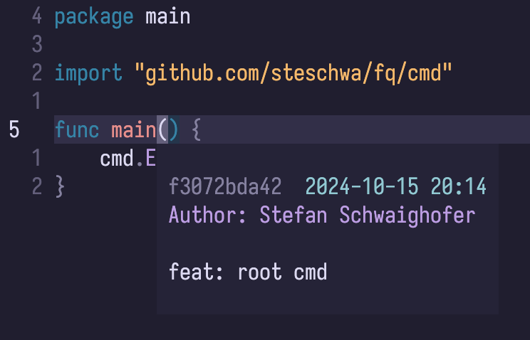

# git-blame.nvim

A Neovim plugin that displays Git blame information for the current line in a floating window.



## Features

- Displays Git blame information in a floating window.
- Highly customizable rendering of blame information through provider functions.

## Installation

To install `git-blame.nvim`, you can use your preferred plugin manager. For example, using `lazy.nvim`:

```lua
return {
    "steschwa/git-blame.nvim",
    opts = {
        -- see below for the full configuration reference
    }
}
```

## Configuration

The plugin allows for extensive customization of how the blame output is displayed.
You can define your own provider functions that dictate what information to show and how to format it.

The configuration has a single `lines` field, which is a list of rows.
Each row consists of `n` provider functions that receive a `git-blame.BlameInfo` object as their only parameter and return a `git-blame.Part`.
A `git-blame.Part` is a table that contains the text to display and an optional highlight group.

<details>
<summary>Types</summary>

```lua
---@class git-blame.BlameInfo
---@field sha string
---@field author string
---@field author_email string
---@field timestamp integer -- unix timestamp in seconds
---@field message string

---@class git-blame.Part
---@field text string
---@field hl string?

---@alias git-blame.Provider fun(blame: git-blame.BlameInfo): git-blame.Part
```

</details>

### Default Configuration

```lua
{
    lines = {
        -- see "Example Configuration" below
    },
    window = {
        -- used for `vim.api.nvim_open_win()`
        border = "single"
    }
}
```

### Example Configuration

Here is an example of how to configure the plugin with custom provider functions:

```lua
local provider_sha = function(blame)
    -- reuse highlight groups (e.g. Comment)
    return { text = blame.sha:sub(1, 10), hl = "Comment" }
end

local provider_time = function(blame)
    -- see `man strftime` for a list of format placeholders
    local formatted_time = vim.fn.strftime("%F %R", blame.timestamp)
    return { text = formatted_time, hl = "GitBlameTime" }
end

local provider_author = function(blame)
    return { text = string.format("Author: %s", blame.author), hl = "GitBlameAuthor" }
end

local provider_message = function(blame)
    return { text = blame.message, hl = "GitBlameMessage" }
end

return {
    "steschwa/git-blame.nvim",
    keys = {
        { "gb", "<cmd>GitBlameLine<cr>" }
    },
    opts = {
        lines = {
            { provider_sha, provider_time},
            { provider_author },
            {}, -- empty line
            { provider_message },
        }
    }
}
```

> [!NOTE]  
> This plugin does not define any highlight groups by itself.  
> Make sure you create them on demand:
>
> ```lua
> vim.api.nvim_set_hl(0, "GitBlameTime", { link = "Label" })
> ```

This produces the output of the above screenshot.

You can customize the output further by adding more rows or provider functions as needed, allowing for a flexible and tailored display of blame information.

## Usage

- `:GitBlameLine`: Displays the Git blame information for the current line. If the blame window is already open, it will focus on it.

## Contributing

Contributions are welcome! Please feel free to submit a pull request or open an issue for any bugs or feature requests.

## License

This project is licensed under the MIT License. See the [LICENSE](LICENSE) file for details.
